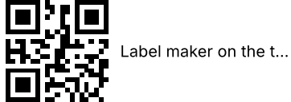
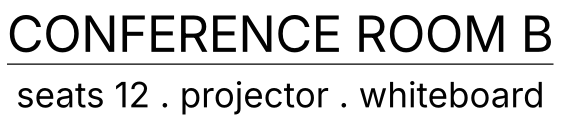
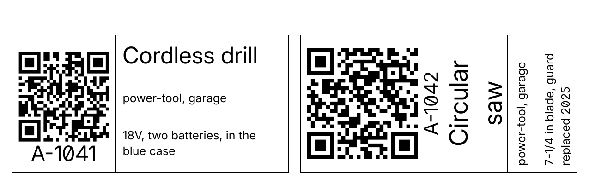

# Authoring label templates

A template is one YAML file that describes one label. This guide walks from a blank file to a working
label through worked examples, in the order the concepts actually bite.

[`SPEC.md`](SPEC.md) is the normative reference for the behavior it documents: it states every rule
precisely, organised by subsystem. This guide is organised by what you are trying to do, and links
into the spec rather than restating it. Where this guide and the normative rules disagree, this guide
is the bug.

The normative rules live in two places. `SPEC.md` is frozen at commit `bc7b1ce` (2026-08-19, ADR-0057);
behavior added or changed after that date lives in `openspec/specs/<capability>/spec.md`. To look a
rule up: read `SPEC.md`, then check whether an `openspec/specs/` requirement names and supersedes that
section. If one does, it wins for that section; otherwise `SPEC.md` holds.

Every worked example below is a template that ships in this repo, under `catalog/` or
`tests/fixtures/templates/`, so the guide cannot drift from the shipped set, and every render shown
is that template's actual output. A handful of short snippets exist only to isolate one rule; those
are labelled where they appear.

## Contents

1. [The authoring loop](#1-the-authoring-loop)
2. [Anatomy of a template](#2-anatomy-of-a-template)
3. [A fixed-size label, end to end](#3-a-fixed-size-label-end-to-end)
4. [Auto-length tape labels: how the width is decided](#4-auto-length-tape-labels-how-the-width-is-decided)
5. [`auto` means two different things](#5-auto-means-two-different-things)
6. [`max_w` and `max_h` are caps](#6-max_w-and-max_h-are-caps)
7. [Edge-relative coordinates](#7-edge-relative-coordinates)
8. [`to:` instead of `size:`](#8-to-instead-of-size)
9. [Containers: nesting, padding, frames, options, rotation](#9-containers-nesting-padding-frames-options-rotation)
10. [Why some mistakes are caught at startup and others at print time](#10-why-some-mistakes-are-caught-at-startup-and-others-at-print-time)
11. [Troubleshooting](#11-troubleshooting)

---

## 1. The authoring loop

A template that parses is not a label that looks right. Render it and look at it.

A fresh config directory starts with no templates — nothing is seeded — so put the YAML there
yourself before the first render.

```bash
# Serve, with auth off so curl works without a token.
LABELER_CONFIG_DIR=./config-dev LABELER_NO_AUTH=true cargo run --bin labeler

# In another shell: install the templates these examples use, then pick them up.
mkdir -p config-dev/templates
cp catalog/tape/brother/brother_24mm.yaml catalog/sheet/avery/avery5163.yaml \
   tests/fixtures/templates/*.yaml config-dev/templates/
curl -s -X POST localhost:8080/api/templates/reload

# Single (tape) templates render straight to PNG.
curl -s -X POST 'localhost:8080/api/render/label?format=png' \
  -H 'Content-Type: application/json' \
  -d '{"template":"brother_24mm","data":{"message":"Kitchen Utensils"}}' \
  -o out.png

# Sheet templates go through /api/batch and are always PDF.
curl -s -X POST localhost:8080/api/batch \
  -H 'Content-Type: application/json' \
  -d '{"template":"avery5163","mode":"download","labels":[{"data":{"message":"Hello"}}]}' \
  -o out.pdf
```

Edit the YAML, then `curl -s -X POST localhost:8080/api/templates/reload` to pick up the change
without a restart, and render again. Templates live in `{LABELER_CONFIG_DIR}/templates/`.

Check the render against your intent, not against "it returned 200": is the text inside the printable
area, is the QR square, did auto-shrink kick in when you did not expect it, is anything clipped at an
edge. Those are the failures a 200 hides.

## 2. Anatomy of a template

```yaml
id: my_label          # unique across the templates directory
name: My Label        # shown in the UI
group: Warehouse      # optional: category name for grouping and filtering in the UI
unit: mm              # mm | in — every coordinate and size below is in this unit
dpi: 180              # raster resolution for PNG output
params: { ... }       # typed inputs, defaults, bounds, and UI hints (see §9)
format: { ... }       # the physical shape of the label (below)
layout: [ ... ]       # the tree of items to draw
```

`group` is an optional string (1 to 64 characters) used to categorize templates in the web UI. Grouping
is a flat single level: a slash in a group name (e.g. `Shipping/Pallets`) carries no directory or
hierarchical structure and is treated simply as a character in the name. Templates without a `group`
field are treated as ungrouped.

An invalid template is quarantined on load while other templates continue to serve. Full field table:
[SPEC §3](SPEC.md#3-template-schema).

An unknown field at the top level, or on a layout item, is rejected — so a misspelled `paddding` on a
container fails loudly. That guard does **not** reach inside the nested objects: a typo within
`format`, `alignment`, `params` or `frame` is dropped rather than reported. You still hear about it if
the field it was meant to set is required — a misspelled `format.height` fails as a *missing* field —
but a misspelled optional one (`alignment.vertcal`, `params.quiet_zne`) silently leaves the default in
place. If a setting appears to have no effect, check its spelling first.

`format` comes in two shapes, and almost every rule that surprises people follows from which one you
picked.

**`sheet`** — a grid of identical, fixed-size slots on a fixed page. You get a PDF.

```yaml
format:
  type: sheet
  paper_width: 8.5
  paper_height: 11.0
  label_width: 4.0
  label_height: 2.0
  positions:            # bottom-left corner of each slot, page origin bottom-left
    - [0.17, 8.5]
    - [4.33, 8.5]
```

**`single`** — one label. Its height is always fixed; its width is either fixed, or a `{min, max}`
range, which makes it **auto-length**: continuous tape, cut to fit the content.

```yaml
format:
  type: single
  width: { min: 10.0, max: 120.0 }   # auto-length. A bare number would be fixed-width.
  height: 18.1                       # printable height, narrower than the nominal tape
  media_width: 24                    # nominal tape width; print preflight only, no effect on geometry
```

Whether `format.width` is a number or a range is the single most consequential choice in the file. It
decides what `auto` means (§5), whether the measure pre-pass runs (§4), and which errors can be caught
at startup rather than at print time (§10).

## 3. A fixed-size label, end to end

`catalog/sheet/avery/avery5163.yaml` is the whole thing:

```yaml
id: avery5163
name: Avery 5163 2" x 4" Shipping Label
unit: in
dpi: 300
params:
  message:
    type: string
    description: "Label message text"
format:
  type: sheet
  paper_width: 8.5
  paper_height: 11.0
  label_width: 4.0
  label_height: 2.0
  positions: [[0.17, 8.5], [4.33, 8.5], ...]
layout:
  - type: container
    at: [0.0, 0.0]
    size: [4.0, 2.0]
    padding: 0.15
    items:
      - type: text
        value: "{message}"
        at: [0.0, 0.0]
        size: [3.7, 1.7]
        font_size: { min: 10.0, max: 48.0 }
        multiline: true
        alignment: { horizontal: center, vertical: center }
```

Three things to take from it.

**The origin is bottom-left and y points up.** This is the first thing that surprises people, because
most graphics APIs put the origin at the top-left. `at: [0.0, 0.0]` is the bottom-left corner of the
frame; increasing `y` moves *up*. The renderer flips into Typst's top-left space for you
([SPEC §6](SPEC.md#6-coordinate-system)).

```
 y
 ^     +-------------------------------+  (4.0, 2.0)
 |     |                               |
 |     |            message            |
 |     |                               |
 |     +-------------------------------+
 (0,0)                                    --> x
```

**The frame is the slot, not the page.** Everything in `layout` is positioned inside one 4×2 inch
slot. The engine repeats that layout into every position in `positions` and paginates. You never
write page coordinates.

**A `font_size` range means auto-shrink.** `{min: 10.0, max: 48.0}` starts at 48pt and steps down in
0.5pt increments until the text fits its box; if it still overflows at 10pt, the last line is
ellipsized. A bare number (`font_size: 12.0`) is fixed and will clip rather than shrink.

For a fixed-size label with a QR, `tests/fixtures/templates/avery5163_asset_tag.yaml` is the canonical
example; it is covered in §9 because it also demonstrates containers, parameters, conditional visibility, and rotation.

## 4. Auto-length tape labels: how the width is decided

`catalog/tape/brother/brother_24mm.yaml`:

```yaml
id: brother_24mm
name: Brother 24mm Continuous Label (text only)
unit: mm
dpi: 180
params:
  message:
    type: string
    description: "Label message text"
format:
  type: single
  width: { min: 10.0, max: 120.0 }
  height: 18.1
  media_width: 24
layout:
  - type: container
    at: [0.0, 0.0]
    size: [auto, 18.1]
    padding: 1.0
    items:
      - type: text
        value: "{message}"
        at: [0.0, 0.0]
        size: [auto, 16.1]
        font_size: { min: 10.0, max: 32.0 }
        alignment: { horizontal: center, vertical: center }
```


Because `format.width` is a range, the label has no width until a request arrives with data. The
engine runs a **measure pre-pass** over the layout before rendering anything: it walks the items,
computes how far right the content reaches, clamps that to `[width.min, width.max]`, and only then
renders into the resulting frame. This pre-pass is the load-bearing concept of the whole engine, and
everything in §5 through §8 is a consequence of it.

### What contributes to the measured width

| Item | Contributes |
| --- | --- |
| `text` with a content-driven width | `at.x` + the width its string actually needs at the chosen font size |
| `text`/`qr`/`image`/`container` with a numeric width | `at.x + width` — a constant you wrote |
| `qr` / `image` with `size: [auto, …]` | `at.x` + the remaining budget, capped by `max_w` (§6) |
| `container` with a content-driven width | `at.x` + padding + whatever its children measured to |
| `line` | the larger of its two endpoints' `x`, and nothing else |
| anything anchored with an edge-relative `at.x` (§7) | only its **inset** — the narrowest label it fits on |
| a `text` or `container` whose `to.x` is edge-relative | its content, **plus** the right margin that `to.x` asks for (`to: [-2.0, …]` reserves 2 units to the right of the content) |
| a `qr` or `image` whose `to.x` is edge-relative | nothing at all — see the warning below |

Three rows are worth dwelling on, because they are the ones that trip people up.

**A `line` contributes only the coordinates you wrote, never any content of its own.** A rule drawn to
a fixed `x` of 40 does hold the label to at least 40 wide — that is a number you asked for. But a rule
drawn to the right *edge* (§7) contributes nothing, so it spans whatever the text decided rather than
deciding it. That is the difference between a divider that follows the content and one that pins the
label open.

**A right-anchored item cannot define the width it is anchored to.** If `at.x` is edge-relative, its
position depends on the final width, which is what the pre-pass is trying to compute. Circular. So the
item contributes only its inset — the narrowest label on which it would still fit — and nothing more.

**A `qr` or `image` spanning to the right edge contributes nothing, and that can fail.** Neither item
type has an intrinsic content width the engine measures, so a frame-dependent `to` on one of them adds
zero to the extent: the item simply stretches to whatever width the label ends up at. If nothing else
on the label sizes the content, the width falls back to `width.min` — and if the item's own `at.x`
sits further right than `width.min`, its box resolves negative and the render fails with
`UnsupportedLayoutItem`. Give such an item a numeric size, or put something measurable beside it.
Intrinsic QR/image sizing is deferred ([#149](https://github.com/pfa230/labeler/issues/149)).

Two things that are *not* measured: a rotated container's subtree (its inner axes are swapped, which
the width model does not handle), and any container whose `option` gate does not match the current
selection.

Fixed-width `single` templates and `sheet` templates skip the pre-pass entirely. Their frame is known
before the request arrives.

## 5. `auto` means two different things

This is the trap. `auto` on a size axis resolves differently depending on the template's format, and
the two meanings are close enough to conflate and far enough apart to break a layout.

**On a fixed-width label (fixed-width `single`, or any `sheet`), `auto` means "fill the parent."**
Specifically, it means *the space remaining from this item's own anchor*, not the whole frame
(illustrative snippet, not a shipped template):

```yaml
format: { type: single, width: 60.0, height: 20.0 }
layout:
  - type: container
    at: [10.0, 2.0]
    size: [auto, auto]      # -> 50mm wide (60 - 10), 18mm tall (20 - 2)
```

The subtraction uses the *resolved* anchor, so an edge-relative `at` (§7) is measured inward from the
far edge first. This is [ADR-0054](adr/0054-auto-fallback-position.md); before it, `auto` resolved to
the whole frame and an item anchored anywhere but the origin overflowed.

**On an auto-length label, `auto` width on a `text` means "shrink to content."** That is what makes
the tape cut to fit:

```yaml
params:
  message:
    type: string
format: { type: single, width: { min: 10.0, max: 120.0 }, height: 18.1 }
layout:
  - type: text
    value: "{message}"
    size: [auto, 16.1]      # -> exactly as wide as the string needs
```

Two consequences that follow directly:

- **An empty value produces a short label, not a blank full-width one.** "Shrink to content" with no
  content shrinks to nothing, clamped up to `width.min`. That is intended.
- **A container gets there differently, in two steps.** This is worth being precise about, because
  the tape templates all wrap their text in one. During the measure pre-pass, an auto-width container
  contributes its *children's* measured extent plus its padding — that is what sizes the label. Then,
  at render, its own `auto` width resolves to the frame remainder (`label_width - at.x`) of the label
  that measurement just produced. So a container does end up content-sized, but only because its
  children sized the label first; the container itself never measures its own content. The practical
  consequence: two sibling auto-width containers on one tape do not each shrink to their own content —
  they both fill from their anchor to the label's right edge, and overlap. Give them explicit widths,
  a `to`, or a `max_w`. See [SPEC §4](SPEC.md#4-layout).

**`qr` and `image` have neither meaning.** Neither has an intrinsic content footprint to shrink to, so
`auto` on them resolves to exactly `max_w` and is a hard error without one — never a fill. If you want
a QR to fill a space, say how big:

```yaml
- type: qr
  value: "{code}"
  at: [0.0, 0.0]
  size: [auto, 18.1]
  max_w: 18.1          # required; `auto` here means "18.1", not "as much as is left"
```

## 6. `max_w` and `max_h` are caps

`max_w` and `max_h` bound the resolution of `auto` on their axis, in validation, measurement, and
rendering, on every format ([ADR-0053](adr/0053-max-bounds-cap.md)). Two rules:

**They cap `auto`; they never clamp a number.** `size: [40.0, …]` with `max_w: 30.0` is 40 wide. If
you want 30, write 30. A `max_*` is an upper bound on a value the engine computes, not a constraint on
one you wrote.

**On an auto-length label they cap content, which is the useful case.** For a `text`, `auto` there
already means "shrink to content", so `max_w` limits how much content-driven width the item may claim.
For a `qr` or `image` the cap is doing something different: with no content to shrink to, `max_w` *is*
the width (§5), and what it caps is how much of the tape's budget the item reserves.
`tests/fixtures/templates/brother_24mm_max_w_cap.yaml`:

```yaml
params:
  code:
    type: string
  message:
    type: string
format: { type: single, width: { min: 10.0, max: 150.0 }, height: 18.1 }
layout:
  - type: qr
    value: "{code}"
    at: [1.0, 0.0]
    size: [auto, 18.1]
    max_w: 18.1
  - type: text
    value: "{message}"
    at: [21.1, 0.0]
    size: [auto, 18.1]
    max_w: 30.0
    font_size: { min: 8.0, max: 32.0 }
    alignment: { horizontal: left, vertical: center }
```



The message is "Label maker on the third shelf", which would want far more than 30mm. It is capped at
30, so the label comes out at exactly 51.1mm (21.1 + 30) and the text ellipsizes inside its cap
instead of running the tape out to `width.max`.

`max_w` and `max_h` are an error alongside `to:` (§8), which has no `auto` axis to bound.

## 7. Edge-relative coordinates

A coordinate component that is **sign-negative** is measured inward from the frame's far edge instead
of outward from its origin ([ADR-0051](adr/0051-edge-relative-and-corner-placement.md)):

| Component | Sign | Measured from |
| --- | --- | --- |
| `x` | non-negative | left edge |
| `x` | sign-negative | **right** edge: `frame_width + x` |
| `y` | non-negative | bottom edge |
| `y` | sign-negative | **top** edge: `frame_height + y` |

`-0.0` (or `-0` in YAML) is the far edge exactly; `-2.0` is 2 units inside it. The test is the *sign
bit*, not `< 0`, precisely so that `-0.0` can mean "the far edge" — in floating point, `-0.0 < 0.0` is
false.

Edge-relative components apply to `at` and to `to`, never to `size`, `max_w`, `max_h`, `padding` or
`thickness`, and they resolve against the **current** frame: the label (for a sheet template, one
slot — never the page), a container's padded inner box, or a rotated container's swapped canvas.

The motivating case is anything that should span the full width of a label whose width you do not
know. `tests/fixtures/templates/brother_24mm_lines_divider.yaml`:

```yaml
params:
  line1:
    type: string
  line2:
    type: string
layout:
  - type: container
    at: [0.0, 0.0]
    size: [auto, 18.1]
    padding: 1.0
    items:
      - type: text
        value: "{line1}"
        at: [0.0, 8.6]
        to: [-0.0, 16.1]        # spans to the right edge of the padded inner box
        font_size: { min: 8.0, max: 20.0 }
        alignment: { horizontal: center, vertical: center }
      - type: line
        at: [0.0, 8.05]
        to: [-0.0, 8.05]        # full-width rule
        thickness: 0.2
      - type: text
        value: "{line2}"
        at: [0.0, 0.0]
        to: [-0.0, 7.5]
        font_size: { min: 6.0, max: 14.0 }
        alignment: { horizontal: center, vertical: center }
```



Both text boxes span the full width, so each centers independently, and the rule spans whatever width
the longer line settled on. Nothing here names a width.

**The constraint to know:** on an auto-length label, an edge-relative `at.x` cannot be combined with an
`auto` or otherwise frame-dependent width on the same item. Anchoring to the right edge *and* asking
the frame to size you is circular, and the template is rejected at load.

## 8. `to:` instead of `size:`

Every box item takes exactly one of `size` or `to`. `to` names the opposite (top-right) corner, and
the size falls out: `size = to - at`, after both corners resolve.

Reach for `to` when the corner is the thing you actually know. `to: [-0.0, 16.1]` above says "span to
the right edge, top out at 16.1" — with `size` you would have to write the width, which is the number
you do not have. Reach for `size` when the dimension is the thing you know: a 1.3-inch QR is a
`size`, not a corner.

Rules:

- `size` and `to` are mutually exclusive, and exactly one is required. A `container` that gives
  neither defaults to `size: [auto, auto]`.
- `max_w` / `max_h` are an error alongside `to`.
- `to` must resolve above and to the right of `at`. A corner that is already inverted against the
  widest frame the label could have is rejected at load (`template_validation_failed`); one that only
  inverts against the width a particular request resolved to is `edge_rect_inverted` at render.
- A **zero**-width box is legal at render time (an empty data value can measure to exactly the item's
  own `at.x`); a **negative** one is not.
- `line` uses `at` and `to` as its two endpoints, not as a box; it has no `size`, `fit`, or rotation.
  The endpoints must differ after resolution.

## 9. Containers: nesting, padding, frames, conditional visibility, rotation

A `container` groups items and establishes a new coordinate frame. Its children are positioned
relative to its **padded inner box**, so `at: [0, 0]` inside a container with `padding: 1.0` is 1 unit
in from the container's own bottom-left corner. Sizes and edge-relative coordinates inside resolve
against that inner box too.

```yaml
- type: container
  at: [0.0, 0.0]
  size: [4.0, 2.0]
  padding: 0.15              # uniform; or [top, right, bottom, left]
  frame:                     # optional drawn outline
    thickness: 0.02
    rounded: false
  items: [ ... ]
```

### Conditional visibility (`when:`) and parameters

Declare the parameters a template supports in `params:`, then gate containers (or any layout items)
using `when:` conditions. This is how one template serves several layouts or optional elements (ADR-0055).

```yaml
params:
  orientation:
    type: enum
    values: [horizontal, vertical]
    default: horizontal
  outline:
    type: enum
    values: [yes]
```

When a request arrives, each item carrying a `when:` map renders only if all conditions match the
resolved parameter values. `tests/fixtures/templates/avery5163_asset_tag.yaml` uses three top-level
containers: an outline-only one that draws a border, a `horizontal` one, and a `vertical` one:

```yaml
layout:
  - type: container
    when:
      outline: yes
    at: [0.0, 0.0]
    size: [4.0, 2.0]
    frame: { thickness: 0.02, rounded: false }
    items: []
  - type: container
    when:
      orientation: horizontal
    at: [0.0, 0.0]
    size: [4.0, 2.0]
    items:
      - type: qr
        value: "{url}"
        at: [0.1, 0.45]
        size: [1.3, 1.3]
        params: { quiet_zone: 0.0 }
      - type: line
        at: [1.5, 0.0]
        to: [1.5, 2.0]
        thickness: 0.01
      # ... id under the QR, name/tags/description in the right column
```

An unmatched gate removes the whole subtree — it is not rendered, and it is not measured either.
Missing-field validation is lazy: only the active branch requires its parameter fields, so an inactive
branch's `{tokens}` may be absent from the request without causing a `422 MissingField`.

If an optional parameter is omitted from the request, it automatically resolves to its declared `default`
(or `false` for booleans, or the first allowed value for enums).

### Rotation

A container may set `rotate` to turn a portrait design onto a landscape slot: the "read by turning the
label" layout ([ADR-0036](adr/0036-container-rotation.md)). The `vertical` branch of the asset tag is
the same information authored in a 2×4 portrait canvas and rotated onto the 4×2 slot:

```yaml
  - type: container
    when:
      orientation: vertical
    at: [0.0, 0.0]
    size: [4.0, 2.0]
    rotate: 90
    items:
      - type: qr
        value: "{url}"
        at: [0.2, 2.3]        # authored in the swapped [2, 4] canvas
        size: [1.6, 1.6]
      # ...
```



What to know:

- **Container-only and orthogonal.** `rotate` on any other item type, or a value that is not a
  multiple of 90, is a validation error. Degrees are counter-clockwise.
- **The footprint stays in parent coordinates.** `at` and the extent describe the container's box in
  its parent exactly as if it were not rotated. Rotation is purely an inner transform.
- **The inner canvas swaps for 90 and 270.** Author children against `[inner_h, inner_w]`. Padding is
  author-space and rotates with the design; the drawn `frame` outline does not rotate.
- **No `auto` under rotation.** A rotated container needs an extent that resolves at compile time, and
  no descendant may use `auto` — the author-horizontal axis maps to physical-vertical, which the
  width model does not handle.

## 10. Why some mistakes are caught at startup and others at print time

Templates are validated when the server loads them, and a file that fails is quarantined and
reported rather than served. So a
`422` from a template that loaded fine looks like a contradiction. It is not.

The split is about **geometry**. Data-driven failures — a missing field, an undecodable image, an
interpolation token that resolves to nothing — are per-request on every format, because the data
arrives with the request. What differs between formats is when the *layout* can be checked.

On a fixed-width label every coordinate is a constant once the file parses, so load-time validation of
the geometry is exact: anything that can be wrong about the layout is wrong then.

On an **auto-length** label the frame width is not known until the measure pre-pass runs, which needs
the request's data. Load-time validation therefore checks the widest case: it bounds coordinates
against `format.width.max`, so a template that could never fit is still rejected at startup. The
render path then re-checks against the width this particular request actually resolved to
([ADR-0051](adr/0051-edge-relative-and-corner-placement.md) §7).

The practical consequence:

| Decidable at load | Only decidable per request |
| --- | --- |
| An absolute coordinate past `width.max` | A coordinate that fits `width.max` but not *this* label's width |
| A structurally impossible combination (edge-relative `at.x` with a frame-dependent width) | Whether the content measured wide enough to leave room |
| A `size` that is not `> 0`, a missing `max_w` on an `auto` QR | A `to`-spanning box that collapsed because its data was empty |
| An inverted `to` against the `width.max` frame | An `auto` axis whose anchor left no room for this data |

So "it loaded fine but 422s on one label" is never a mystery: either the data is missing or unusable,
or, on an auto-length label, it produced a width the layout cannot live in. Either way the failing
*data* is what to look at, not the template.

## 11. Troubleshooting

Four error codes carry a stable `details.reason` slug naming the specific cause; match on the slug,
never on the message text ([SPEC §10.1](SPEC.md#101-detailsreason)). Everything else is identified by
`code` alone. Every row below is a slug except `MissingField` and `InvalidOptionValue`, which are codes and carry no slug.

| Reason / Code | What actually happened | Usual fix |
| --- | --- | --- |
| `size_auto_without_max` | `auto` on an axis with no way to resolve it — almost always a `qr` or `image`, which have no content fallback. | Add `max_w` (or `max_h`), or write a number. |
| `size_auto_no_room` | `auto` resolved through the anchor fallback and got `<= 0`: the item's own `at` consumed the whole frame on that axis. | Move the anchor left/down, or give the item an explicit size. |
| `max_size_invalid` | The binding `max_*` is not `> 0`. | It is your `max_*` at fault here, not the anchor — check the number. |
| `size_invalid` | A numeric `size` component is not `> 0`. Only a written-out number triggers this; bad `to` geometry raises one of the two below. | Check for a `0` or a negative in `size`. |
| `edge_rect_inverted` | `to` did not resolve above and to the right of `at` — for *this* request's frame. A corner already inverted against `width.max` is caught at load as `template_validation_failed` instead. | Check signs: `to: [-0.0, …]` is the right edge, `to: [0.0, …]` is the left one. |
| `coord_out_of_frame` / `item_out_of_frame` | A resolved coordinate or box falls outside the frame. On an auto-length label this can be per-request; see §10. | Remember children resolve against the container's **padded inner** box, not its outer size. |
| `line_endpoint_out_of_frame` | A line endpoint resolved outside the frame. Endpoints are errors, not clipped. | Same as above; check the container frame you are actually in. |
| `dimension_exceeds_limit` | A resolved label dimension exceeds the `max_label_dimension_mm` application setting (default 1000mm) or is `<= 0`. | Check requested dimension parameters or update the setting. |
| `container_padding_no_room` | A container's padding meets or exceeds its dimensions, leaving no room for content. | Reduce container padding or increase container size. |
| `MissingField` (422) | A `{token}` or data-bound image `name` has no value in the request `data` and no declared `default` in `params:`. | Check parameter spelling. An inactive `when:` branch never demands its unreferenced parameters (§9). |
| `InvalidOptionValue` (422) | An `enum` parameter was supplied with a value not in its declared `values`. | Check allowed enum values declared in the template's `params:`. |
| `template_validation_failed` (at startup) | Structural validation. The message carries the JSON path to the offending item. | Read the path; it names the exact item. |
| `auto_length_cursor_mismatch` (500) | Internal invariant: the measure and render passes disagreed about which items they visited. | Not an authoring error — file an issue with the template and data. |

Two visual failures that return `200` and still need fixing:

**Text is smaller than expected.** A `font_size` range shrank it to fit. The box is too small, or on a
`top`/`bottom`-aligned item the ink reservation ate the room: those alignments inset the block by the
font's overflow at that edge so descenders and accents cannot clip, which costs height
([ADR-0050](adr/0050-ink-reservation-at-slot-edges.md)). `center` is not inset, and can still clip in
a slot shorter than about `1.21 × font_size`.

**Lowercase text sits lower in its slot than all-caps.** Vertical alignment positions a fixed metric
box running cap-height to baseline, so the space above the baseline is reserved whether or not the
string uses it. This is inherent to baseline alignment and is what every other renderer produces
([ADR-0045](adr/0045-vertical-text-alignment.md)).

---

## Where to go next

- [`SPEC.md`](SPEC.md) — the normative reference for every field, rule, and error code.
- [`adr/`](adr/) — why each decision is the way it is.
- `catalog/` — the shipped starter templates, the best base to copy from.
- `tests/fixtures/templates/` — templates that exist to demonstrate engine features (QR layouts,
  multiline, sheet options, rotation, edge-relative placement, interpolation).
