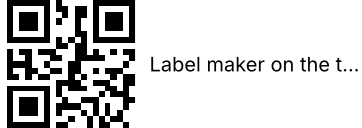
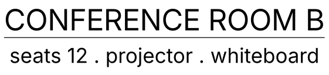
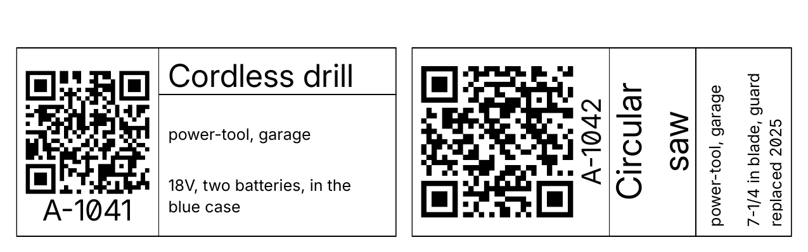

# Authoring label templates

A template is one YAML file that describes one label. This guide teaches the model by example; the rules themselves live in [`openspec/specs/`](../openspec/specs/), one spec per domain, and where this guide and a spec disagree, the guide is wrong.

Examples are drawn from templates under `catalog/` and `tests/fixtures/templates/`, except the flow snippet, which is marked.

## The authoring loop

A template that parses is not a label that looks right. Render it and look at the image.

```bash
# Serve with auth off, so curl needs no token.
LABELER_CONFIG_DIR=./config-dev LABELER_NO_AUTH=true cargo run --bin labeler

# In another shell: install the templates this guide uses, then load them.
mkdir -p config-dev/templates
cp catalog/tape/brother/brother_24mm.yaml catalog/sheet/avery/avery5163.yaml \
   tests/fixtures/templates/*.yaml config-dev/templates/
curl -s -X POST localhost:8080/api/templates/reload

# A single (tape) template renders to PNG.
curl -s -X POST 'localhost:8080/api/render/label?format=png' \
  -H 'Content-Type: application/json' \
  -d '{"template":"brother_24mm","data":{"message":"Kitchen Utensils"}}' -o out.png

# A sheet template renders through /api/render, always to PDF.
curl -s -X POST localhost:8080/api/render \
  -H 'Content-Type: application/json' \
  -d '{"template":"avery5163","labels":[{"data":{"message":"Hello"}}]}' -o out.pdf
```

Nothing is seeded into a fresh config directory, so copy templates in yourself. After each edit, `POST /api/templates/reload` and render again. Open the image and check it against your intent: text inside the printable area, a square QR, no unexpected shrinking, nothing clipped at an edge. A `200` hides all of these.

A file that fails to load does not stop the server. It is left out and listed under `broken` in `GET /api/templates`, with a message naming the offending key or item path. So is anything in `templates/` that is not a `<id>.yaml` file, such as a subfolder or a `.yml`.

## Anatomy of a template

```yaml
name: My Label        # shown in the UI
categories: [Tape]    # optional; the Labels view filters by these
unit: mm              # mm | in: every coordinate and size is in this unit
dpi: 180              # PNG raster resolution
params: [ ... ]       # the inputs a request supplies
format: { ... }       # the label's physical shape
layout: [ ... ]       # the items to draw, back to front
```

`templates/` is one flat folder, and the id is the filename stem: `templates/pallet.yaml` is `pallet`; there is no `id:` key. A key the template does not define, or any key written as `null`, fails the load and names itself.

`format` comes in two shapes, and most surprises follow from which one you picked:

- **`sheet`**: identical fixed-size slots on a page. The layout describes one slot, and the engine repeats it into every position. Output is PDF.
- **`single`**: one label. A numeric `width` is fixed; a `{ min, max }` range makes it **auto-length**: continuous tape cut to fit the content.

Full key tables: [templates](../openspec/specs/templates/spec.md), [parameters](../openspec/specs/parameters/spec.md), [layout](../openspec/specs/layout/spec.md), [text](../openspec/specs/text/spec.md).

## A fixed-size label: `catalog/sheet/avery/avery5163.yaml`

The format declares a US Letter page, 4×2 inch slots and ten slot positions. The layout is one padded container holding one text:

```yaml
layout:
  - type: container
    at: [0.0, 0.0]
    size: [4.0, 2.0]
    padding: 0.15
    items:
      - type: text
        value: "{message}"
        at: [0.0, 0.0]
        size: [3.7, 1.7]
        font_size:
          min: 10.0
          max: 48.0
        wrap: true
        alignment:
          horizontal: center
          vertical: center
```

**The origin is bottom-left and y points up.** `at: [0.0, 0.0]` is the frame's bottom-left corner, and a larger `y` moves up. The frame is the slot, never the page.

**Children are placed in the container's padded inner box.** With `padding: 0.15`, the text's `[0.0, 0.0]` is 0.15 inch in from the slot corner, and its 3.7×1.7 box exactly fills the inner box.

**A `font_size` range means auto-shrink.** The text starts at 48pt and steps down until it fits its box, wrapping at spaces because `wrap: true`. What still does not fit at 10pt is handled by `overflow` (see below).

Governing specs: [layout, coordinates](../openspec/specs/layout/spec.md#requirement-coordinates-are-bottom-left-y-up-and-may-be-edge-relative), [containers](../openspec/specs/layout/spec.md#requirement-containers-establish-a-padded-frame), [rendering, sheet pagination](../openspec/specs/rendering/spec.md#requirement-sheet-pagination).

## An auto-length label: `catalog/tape/brother/brother_24mm.yaml`

```yaml
format:
  type: single
  width:
    min: 10.0
    max: 120.0
  height: 18.1
  media_width: 24
layout:
  - type: container
    at: [0.0, 0.0]
    size: [fill, 18.1]
    padding: 1.0
    items:
      - type: text
        value: "{message}"
        at: [0.0, 0.0]
        size: [fill, 16.1]
        font_size:
          min: 10.0
          max: 32.0
        wrap: false
        alignment:
          horizontal: center
          vertical: center
```


The label has no width until a request arrives. The engine lays the content out against `width.max`, asks each top-level item how wide a frame it needs, takes the largest answer and clamps it into `[min, max]`. `height` is the printable height (18.1mm on 24mm tape); `media_width` is sent with each print job, so a printer that knows its loaded tape can refuse the wrong one.

What an item needs is the smallest frame that contains it: `at.x` plus its width for an ordinary item. Two placements contribute less than they look like they should. An item anchored to the right edge needs only its inset, because its position depends on the width being decided. A `line` contributes only the coordinates you wrote for its endpoints, never content of its own, so a rule drawn to the right edge follows the text rather than holding the label open.

A fixed-width `single` and every `sheet` use their declared size; none of this applies to them.

Governing specs: [auto-length labels](../openspec/specs/templates/spec.md#requirement-auto-length-labels), [requirements](../openspec/specs/layout/spec.md#requirement-an-item-requires-of-its-frame-the-smallest-extent-that-contains-it).

## Concepts that bite

### `content` and `fill`

Each component of `size` is a number, a `"{param}"` reference, `content` (hug the item's own size: laid-out text, QR matrix, a container's children plus padding) or `fill` (stretch to the room left in the frame from the item's anchor). Every boxed item, containers included, sets `size` or `to`.

On an auto-length label the two contribute the same width, because a `fill` item reports its content upward and then takes the frame. They differ afterwards: when the label is wider than the content asked for (clamped up to `width.min`, or widened by another item), a `fill` box takes the slack and `content` does not. That is why the tape above writes `fill`: a short message widens to 10mm and `horizontal: center` centres it there, where a `content` box would sit against the left padding.

A `qr` sized `content` or `fill` needs `module_size` so it has an intrinsic size. An image has none: its box is always authored, and `fit` (`contain`, `cover`, `stretch`) scales the image into it. Governing spec: [extent sources](../openspec/specs/layout/spec.md#requirement-an-extent-comes-from-the-author-the-content-or-the-frame), [intrinsic sizes](../openspec/specs/layout/spec.md#requirement-intrinsic-sizes).

### `max_w` and `max_h` are caps

A cap bounds a `content` or `fill` extent; on a number you wrote, or on a `to`, it is refused at load. `tests/fixtures/templates/brother_24mm_max_w_cap.yaml` puts an 18.1mm QR at `[1.0, 0.0]`, then:

```yaml
  - type: text
    value: "{message}"
    at: [21.1, 0.0]
    size: [content, 18.1]
    max_w: 30.0
    font_size:
      min: 8.0
      max: 32.0
    wrap: false
    alignment:
      horizontal: left
      vertical: center
```



A long message is laid out against a 30mm box, so it shrinks to 8pt and is shortened with `...` instead of running the tape out to 150mm. The cap does not become the width: the label ends where the shortened text ends. Governing spec: [extent sources](../openspec/specs/layout/spec.md#requirement-an-extent-comes-from-the-author-the-content-or-the-frame).

### Text fitting and overflow

A text is laid out against the box it will get. A `font_size` range shrinks in 0.5pt steps until every line fits; a fixed size skips that step. Whatever still does not fit goes to `overflow`. The default, `ellipsis`, drops trailing lines and trims over-wide lines ending them in `...`; `overflow: fail` refuses the label with `text_does_not_fit` rather than print a shortened value, which is what you want for asset ids and anything scanned. Neither ever clips: when even `...` cannot fit, both fail.

Hard newlines in the data always break a line. `wrap: true` also breaks at spaces to the box width, never inside a word. Fitting counts the ink an accent or descender carries past the cap-height-to-baseline box, so `Égypt` may shrink further than `HELIX` in the same box.

Governing spec: [text](../openspec/specs/text/spec.md) ([auto-shrink](../openspec/specs/text/spec.md#requirement-auto-shrink), [overflow policy](../openspec/specs/text/spec.md#requirement-overflow-policy), [vertical alignment](../openspec/specs/text/spec.md#requirement-vertical-alignment)).

### Edge-relative placement and `to:`

A negative coordinate in `at` or `to` is measured inward from the far edge of the current frame: `x: -2.0` is 2 units in from the right, `y: -0.0` is the top edge itself. `to` names the opposite (top-right) corner instead of a size, which is what you want when the corner is the thing you know. `tests/fixtures/templates/brother_24mm_lines_divider.yaml`:

```yaml
    items:
      - type: text
        value: "{line1}"
        at: [0.0, 8.6]
        to: [-0.0, 16.1]
        font_size:
          min: 8.0
          max: 20.0
        alignment:
          horizontal: center
          vertical: center
      - type: line
        at: [0.0, 8.05]
        to: [-0.0, 8.05]
        stroke:
          thickness: 0.2
```



`line2` below the rule spans `at: [0.0, 0.0]` to `to: [-0.0, 7.5]` the same way. Both texts reach the right edge and centre independently; the rule spans whatever width the longer line settled on. Nothing names a width. Write `-0.0`, not `0.0`, for the far edge: `0.0` is the left edge, and a `to` left of its `at` is inverted.

Governing spec: [coordinates](../openspec/specs/layout/spec.md#requirement-coordinates-are-bottom-left-y-up-and-may-be-edge-relative), [placement keys](../openspec/specs/layout/spec.md#requirement-placement-keys).

### Containers, `when:` and rotation

A container groups items into a new frame, its padded inner box, and may paint a `shape` (`rect` or `ellipse`), `stroke`, `background` and `rounded` corners. `when:` shows an item only when every listed parameter matches; an inactive item is not measured, not drawn, and does not require its fields. `tests/fixtures/templates/avery5163_asset_tag.yaml` declares two enums:

```yaml
  - name: orientation
    type: enum
    values: [horizontal, vertical]
    default: horizontal
  - name: outline
    type: enum
    values: [yes]
```

and gates three top-level containers on them: a stroked, empty border under `when: { outline: yes }`, and one container per orientation. `outline` has no default, so a request omitting it gets no border; `orientation` defaults to `horizontal`.

The `vertical` branch is a portrait design rotated onto the landscape slot. `rotate` (container only, multiples of 90, counter-clockwise) leaves the container's footprint in its parent unchanged and swaps its inner canvas for 90 and 270, so children are authored against a 2×4 canvas:

```yaml
  - type: container
    when:
      orientation: vertical
    at: [0.0, 0.0]
    size: [4.0, 2.0]
    rotate: 90
    items:
      - type: qr
        value: "{url}"
        at: [0.2, 2.3]
        size: [1.6, 1.6]
        quiet_zone: 0.0
```



Governing spec: [when](../openspec/specs/layout/spec.md#requirement-when-gates-an-item), [rotation](../openspec/specs/layout/spec.md#requirement-container-rotation), [shapes and paint](../openspec/specs/layout/spec.md#requirement-shapes-and-paint-keys), [colours](../openspec/specs/layout/spec.md#requirement-the-colour-vocabulary).

### Flow

A container with `flow:` packs its children in order instead of placing each by coordinates; packed children carry no `at` or `to`. No shipped template uses it, so this snippet is illustrative, a QR beside a title on tape:

```yaml
  - type: container
    at: [0.0, 0.0]
    size: [fill, 18.1]
    padding: 1.0
    flow:
      direction: row
      gap: 2.0
    items:
      - type: qr
        value: "{code}"
        size: [16.1, 16.1]
      - type: text
        value: "{title}"
        size: [content, 16.1]
        max_w: 60.0
        font_size:
          min: 8.0
          max: 14.0
```

Each packed child is sized as if it sat alone at the inner box's origin, then placed after its predecessor. So an uncapped `content` or `fill` child placed after a sibling can claim the whole inner width and overrun it (`item_out_of_frame`); cap it with `max_w` as above. Gated-off and empty children leave no gap. `wrap: true` continues onto further lines, and `overflow: trim` drops what does not fit instead of failing. `repeat:` on a packed container draws it once per element of a `list` parameter.

Governing spec: [flow](../openspec/specs/layout/spec.md#requirement-a-flow-block-packs-a-containers-children), [packed children](../openspec/specs/layout/spec.md#requirement-packed-children), [repeat](../openspec/specs/layout/spec.md#requirement-repeat-draws-a-container-once-per-list-element).

## Parameters and tokens

Every `{name}` a layout reads must be declared in `params:`; a value comes from the request's `data` or the declared `default:`, and nothing else. `{vars.key}` reads the server's variables store, and `{sys.now}` the render instant. A format attaches with a colon and applies only to an instant, using a named pattern from the `datetime_formats` setting. `tests/fixtures/templates/homebox-qr.yaml` builds its QR from a stored base URL and a request field, `value: "{vars.qr_base_url}/{id}"`, and prints the date with `value: "{sys.now:iso_date}"`.

Use `{sys.now}` when the label must say when it was printed. Declare a `type: datetime` parameter when the caller chooses the date, as `tests/fixtures/templates/brother_24mm_printed_on.yaml` does with `value: "Printed {printed_on:short_date}"`. Write `{{` and `}}` for literal braces.

Governing specs: [parameters](../openspec/specs/parameters/spec.md), [interpolation](../openspec/specs/interpolation/spec.md), [settings](../openspec/specs/settings/spec.md).

## Troubleshooting

Load refuses whatever the template alone shows to be wrong; on an auto-length label it checks geometry against `width.max`. A template that loads can still fail one request, when that request's data is missing or unusable, or produces a width the layout cannot live in: look at the data, not the template. Match on `error.code` and `error.details.reason`, never on the message ([errors](../openspec/specs/errors/spec.md)).

| Symptom or reason | Fix |
| --- | --- |
| Template missing, listed under `broken` | Read its message: it names the key or the item path (`layout[0].items[2]`). Fix, then reload. |
| `template_validation_failed` | Follow the key or item path in the message. Common: a misspelled, misplaced or `null` key, geometry past `width.max`, `size` and `to` together or neither, a `when:` naming an undeclared parameter, a `qr` sized `content` without `module_size`, an unbalanced brace (write literal braces as `{{` and `}}`). |
| `missing_field` | Supply the named field, or declare a `default:`. For `vars.x` set the variable; for `x:fmt` add the format to `datetime_formats`. |
| `data_key_unknown` | The request sends a key the template does not declare. Declare it or drop it. |
| `param_value_invalid` | Send a value the parameter's type accepts: one of an enum's `values`, a number within `min`/`max`, a whole number for `integer`. The same applies to what a tokened `default:` resolves to. |
| `text_does_not_fit` | Enlarge the box, lower `font_size.min`, or (under `fail` only) switch to `ellipsis`. |
| `item_out_of_frame`, `coord_out_of_frame`, `line_endpoint_out_of_frame` | Children resolve against the padded inner box, not the container's outer size. In a flow, cap `content`/`fill` children with `max_w`/`max_h`. |
| `edge_rect_inverted` | Check signs: `-0.0` is the far edge, `0.0` the near one. |
| `size_invalid` | A parameter supplied a size of zero or less. |
| `width_bounds_inverted` | A supplied `width` bound put `max` below `min`. |
| `dimension_exceeds_limit` | A label dimension is zero or less, or over 1000 mm. Check dimension parameters. |
| Text smaller than expected | A `font_size` range shrank it to fit; the box is too small for the value, accents and descenders included. |
| Top-aligned lowercase sits lower than capitals | Alignment places the cap-height-to-baseline box, not the ink. Use `vertical: center` where baselines must match across labels. |
